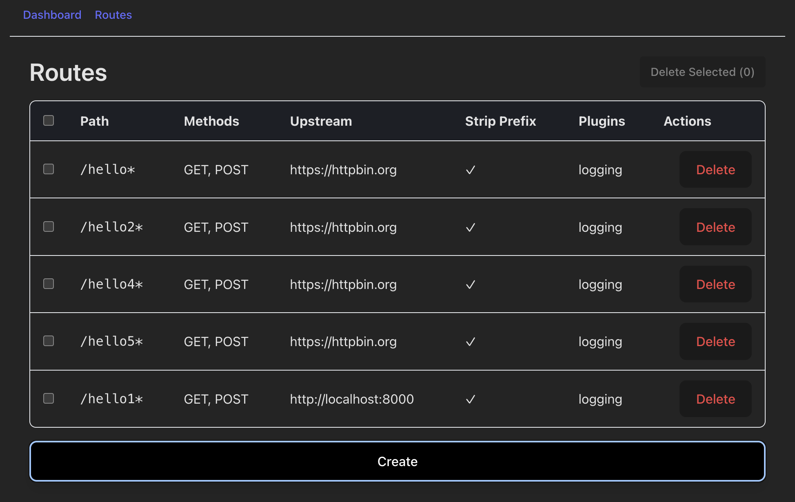

# API Gateway Admin UI

This is the **Admin UI for the Go API Gateway** project.  
Its primary goal is to provide a simple interface to manage gateway routes.  
In the future, it will expand to support metrics, plugin management, and authentication.

---

## 🚀 Tech Stack
- [React](https://reactjs.org/) + [Vite](https://vitejs.dev/) (bundler & dev server)
- [Tailwind CSS](https://tailwindcss.com/) (styling)
- [React Router](https://reactrouter.com/) (routing)
- [TanStack React Query](https://tanstack.com/query/latest) (data fetching & caching)
- [Axios](https://axios-http.com/) (HTTP client)
- [React Hook Form](https://react-hook-form.com/) + [Zod](https://zod.dev/) (forms & validation)

---

## ✨ Features
### Current
- Create, read, update, and delete (CRUD) routes
- Bulk deletion of selected routes

---

## 🖼️ Screenshot

Here’s what the Routes table currently looks like:



### Planned
- Authentication
- Metrics dashboard
- Plugin management

---

## 🛠️ Setup & Development

1. Clone the repo:
   ```bash
   git clone https://github.com/alxmorales2020/api-gateway-admin-ui.git
   cd api-gateway-admin-ui
   ```

2. Install dependencies:
   ```bash
   npm install
   ```

3. Create a `.env.local` file in the project root:
   ```bash
   VITE_API_BASE_URL=/admin
   ```
   > In development, Vite can proxy `/admin` to your Go backend to avoid CORS issues.

4. Start the dev server:
   ```bash
   npm run dev
   ```

5. Open [http://localhost:5173](http://localhost:5173) in your browser.

---

## 👥 Audience

This project is primarily built for my own use, but it also serves as a portfolio project to showcase my ability to design and implement a modern React frontend that interacts with a Go backend API.

---

## 📌 Notes

- For production, the Admin UI should be served alongside the Go API Gateway (via reverse proxy) to avoid CORS and to provide a seamless same-origin setup.
- Roadmap includes stronger authentication and observability features.
